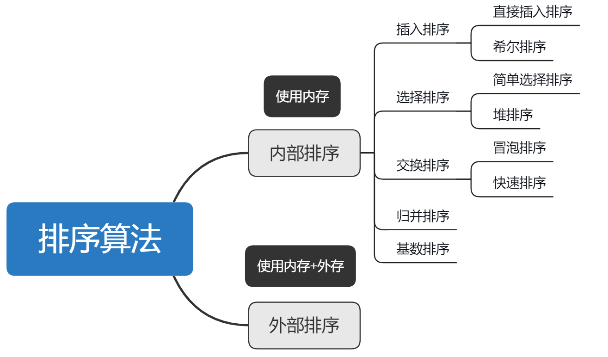

#排序

### 1. 常见的排序算法



### 2. 算法的时间复杂度

#### 2.1 时间频度和时间复杂度

**时间频度T(n)**

一个算法执行所耗费的时间，从理论上是不能算出来的，必须上机运行测试才能知道。但我们不可能也没有必要对每个算法都上机测试，只需知道哪个算法花费的时间多，哪个算法花费的时间少就可以了。并且一个算法花费的时间与算法中语句的执行次数成正比例，哪个算法中语句执行次数多，它花费时间就多。一个算法中的语句执行次数称为语句频度或时间频度。记为T(n)。

**时间复杂度O(n)**

一般情况下，算法中基本操作重复执行的次数是问题规模n的某个函数，用T(n)表示，若有某个辅助函数f(n),使得当n趋近于无穷大时，T（n)/f(n)的极限值为不等于零的常数，则称f(n)是T(n)的同数量级函数。记作T(n)=O(f(n)),称O(f(n)) 为算法的渐进时间复杂度，简称时间复杂度。

在T(n)=4n²-2n+2中，就有f(n)=n²，使得T（n)/f(n)的极限值为4，那么O(f(n))，也就是时间复杂度为O(n²)

- 对于不是只有常数的时间复杂度忽略时间频度的系数、低次项常数

- 对于只有常数的时间复杂度，将常数看为1

#### 2.2 常见的时间复杂度

**常数阶 O(1)**

无论代码执行了多少行，只要没有循环等复杂的结构，时间复杂度都是O(1)

```java
int i = 1;
i++;
```

**对数阶O(log2n)**

此处i并不是依次递增到n，而是每次都以倍数增长。假设循环了x次后i大于n。则2x = n，x=log2n

```java
while(i < n) {
    i = i*2;
}
```

**线性阶O(n)**

这其中，循环体中的代码会执行n+1次，时间复杂度为O(n)

```java
for(int i = 0; i<n; i++) {
	i++;
}
```

**线性对数阶O(nlog2n)**

此处外部为一个循环，循环了n次。内部也是一个循环，但内部f循环的时间复杂度是log2n

所以总体的时间复杂度为线性对数阶O(nlog2n)

```java
for(int i = 0; i<n; i++) {
    j = 1;
	while(j<n) {
		j = j*2;
	}
}
```

**平方阶O(n2)**

```java
for(int i = 0; i<n; i++) {
	for(int j = 0; j<n; j++) {
		//循环体
	}
}
```

**立方阶O(n3)**

```java
for(int i = 0; i<n; i++) {
	for(int j = 0; j<n; j++) {
		for(int k = 0; k<n; k++) {
			//循环体
		}
	}
}
```

>可以看出平方阶、立方阶的复杂度主要是否循环嵌套了几层来决定的

### 3. 排序算法的时间复杂度

| 排序算法 | 平均时间 | 最差时间     | 稳定性 | 空间复杂度 | 备注                                         |
| -------- | -------- | ------------ | ------ | ---------- | -------------------------------------------- |
| 冒泡排序 | O(n2)    | O(n2)        | 稳定   | O(1)       | n较小时好                                    |
| 交换排序 | O(n2)    | O(n2)        | 不稳定 | O(1)       | n较小时好                                    |
| 选择排序 | O(n2)    | O(n2)        | 不稳定 | O(1)       | n较小时好                                    |
| 插入排序 | O(n2)    | O(n2)        | 稳定   | O(1)       | 大部分已有序时好                             |
| 基数排序 | O(n*k)   | O(n*k)       | 稳定   | O(n)       | 二维数组（桶）、一维数组（桶中首元素的位置） |
| 希尔排序 | O(nlogn) | O(ns)(1<s<2) | 不稳定 | O(1)       | s是所选分组                                  |
| 快速排序 | O(nlogn) | O(n2)        | 不稳定 | O(logn)    | n较大时好                                    |
| 归并排序 | O(nlogn) | O(nlogn)     | 稳定   | O(1)       | n较大时好                                    |
| 堆排序   | O(nlogn) | O(nlogn)     | 不稳定 | O(1)       | n较大时好                                    |

### 4. [冒泡排序](./BubbleSorting.java)

算法步骤：

- 比较相邻的元素。如果第一个比第二个大，就交换他们两个。

- 对每一对相邻元素作同样的工作，从开始第一对到结尾的最后一对。这步做完后，最后的元素会是最大的数。

- 针对所有的元素重复以上的步骤，除了最后一个。

- 持续每次对越来越少的元素重复上面的步骤，直到没有任何一对数字需要比较。

- 一共进行了数组元素个数-1次大循环，且每次大循环中需要比较的元素越来越少。

- 优化：如果在某次大循环，发现没有发生交换，则证明已经有序。

### 4. [选择排序]()