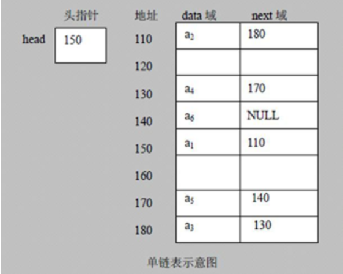
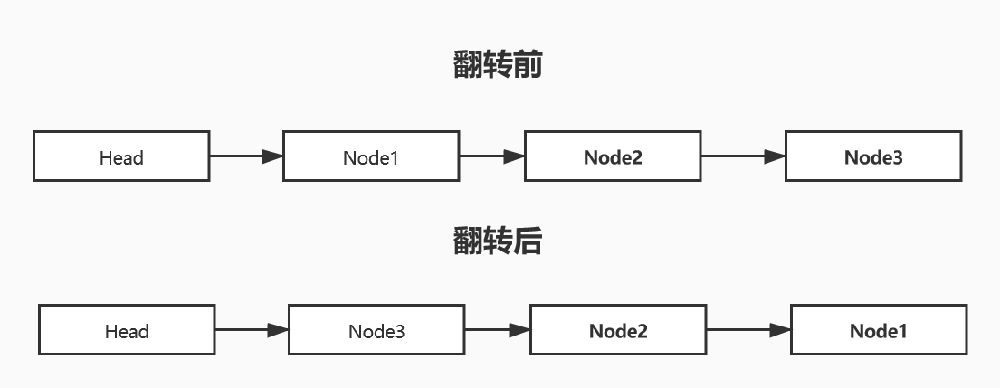
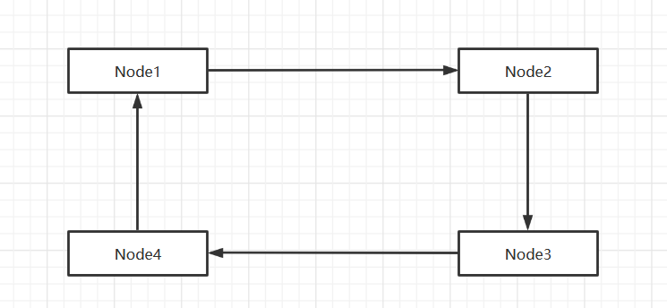

# 队列

## 1.单向链表

### 1.1 单向链表的介绍

链表在内存中的存储


**特点：**

- 链表是以节点的方式来存储,是链式存储
- 每个节点包含 data 域 和 next 域。next域用来指向下一个节点
- 链表的各个节点不一定是连续存储的
- 链表分带头节点的链表和没有头节点的链表，根据实际的需求来确定

带头结点的逻辑示意图


### 1.2 模拟思路
创建（添加）

- 先创建一个Head头节点，表示单链表的头
- 后面我们每添加一个节点，就放在链表的最后

遍历
- 通过一个辅助变量，来遍历整个链表

有序插入

- 先遍历链表，找到应该插入的位置
- 要插入的节点的next指向插入位置的后一个节点
- 插入位置的前一个节点的next指向要插入节点
- 插入前要判断是否在队尾插入

根据某个属性节点修改值

- 先遍历节点，找到修改的位置
- 如果未找到修改节点，则不修改

删除某个节点

- 先遍历节点，找到要删除节点的前一个节点
- 进行删除操作

求倒数第n个节点的信息

- 遍历链表，求出链表的有效长度length（不算头结点）
- 遍历链表到第length-n的节点

翻转链表



- 创建一个新的头结点，作为新链表的头
- 从头遍历旧链表，将遍历到的节点插入新链表的头结点之后
- 注意需要用到两个暂存节点
  - 一个用来保存正在遍历的节点
  - 一个用来保存正在遍历节点的下一个节点

逆序打印

- 遍历链表，将遍历到的节点入栈
- 遍历完后，进行出栈操作，同时打印出栈元素

### 1.3代码实现
[单向链表](./SingleLinkedList.java)

运行结果

```java
无序插入:
Node{no=1, name='aaa'}
Node{no=4, name='ccc'}
Node{no=2, name='bbb'}
Node{no=3, name='ccc'}
有序插入：
准备插入的节点编号 4 已经存在！
Node{no=1, name='aaa'}
Node{no=2, name='bbb'}
Node{no=3, name='ccc'}
Node{no=4, name='ccc'}
以下例子以有序链表为基础
修改链表的值：
Node{no=1, name='aaa'}
Node{no=2, name='bbb'}
Node{no=3, name='ccc'}
Node{no=4, name='ddd'}
链表倒数第3位置值为:
Node{no=2, name='bbb'}
链表倒序为：
Node{no=4, name='ddd'}
Node{no=3, name='ccc'}
Node{no=2, name='bbb'}
Node{no=1, name='aaa'}
链表逆序打印（没有改变链表本身结构）:
Node{no=1, name='aaa'}
Node{no=2, name='bbb'}
Node{no=3, name='ccc'}
Node{no=4, name='ddd'}
删除节点：
Node{no=4, name='ddd'}
Node{no=2, name='bbb'}
Node{no=1, name='aaa'}
链表节点个数为：
3
```

## 2.双向链表

### 2.1 双向链表的介绍
与单向链表相比除了拥有指向下一个节点的next域，还拥有指向上一个节点的pre域。


### 2.2 实现思路

遍历
- 和单向链表的遍历相同，需要一个辅助节点来保存当前正在遍历的节点

添加
- 双向链表多出了一个frnot，所以在添加时，要让新增节点的front指向链表尾节点
修改 和单向链表的修改相同

删除
- 使用temp来保存要删除的节点
- temp.pre.next指向temp.next
- temp.next指向temp.pre
### 2.3代码实现
[双向链表](./DoubleLinkedList.java)

运行结果

```java
输出链表内容：
Node{no=1, name='aaa'}
Node{no=2, name='bbb'}
Node{no=3, name='ccc'}
Node{no=4, name='ddd'}
修改节点内容：
Node{no=1, name='aaa'}
Node{no=2, name='bbb'}
Node{no=3, name='sss'}
Node{no=4, name='ddd'}
反向输出双向链表
Node{no=4, name='ddd'}
Node{no=3, name='sss'}
Node{no=2, name='bbb'}
Node{no=1, name='aaa'}
删除节点后链表：
Node{no=2, name='bbb'}
Node{no=3, name='sss'}
```

## 3.单向环形链表

### 3.1 单向环形链表的介绍
单链表的尾节点指向首节点，即可构成循环链表



### 3.2 实现思路
先创建第一个节点，让first指向该节点，并自我形成环形。
后面每创建一个新的节点，就将current指向新的节点，并形成新的环形链表。

**约瑟夫环问题**

N个人围成一圈，从第S个开始报数，第M个将被杀掉，最后剩下一个，其余人都将被杀掉，求出被杀顺序

- 例如N=5，M=2，S=1，被杀掉的顺序是：2，4，1，5，3
大致思路

- 遍历链表找到指定位置的节点

- 用一个helper保存指定节点的前一个节点，方便删除

- 当run==countNum时，删除此时正在遍历的节点，并将count的值初始化

- 当helper与first指向同一个人时说明已经到最后一个人了
- 思路2：用一个变量loopTime记录已经出圈了几个人，当其等于length时则是最后一个节点

### 2.3代码实现
[单向环形链表及约瑟夫环问题](./Josephu.java)

运行结果

```java
Boy{ no = 1 }
Boy{ no = 2 }
Boy{ no = 3 }
Boy{ no = 4 }
Boy{ no = 5 }
死亡顺序：
Boy{ no = 2 }
Boy{ no = 4 }
Boy{ no = 1 }
Boy{ no = 5 }
Boy{ no = 3 }
```